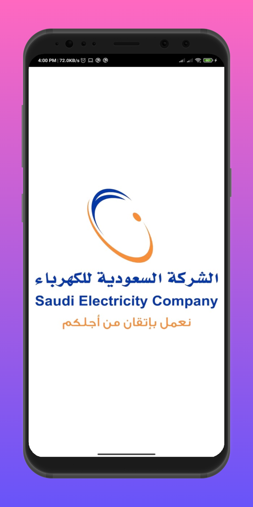

# Data Chack

Screenshots
-------------

    
   
## Description:

### Data Check is :
An App that could help SEC of saudi arabia to review Surveying business company delivered spatial data, taking notes and also taking photos of each signle spatial data


### Our goal is:
we are trying is to ensure that the quality of the Surveying business company is on a heigh standards, and make it easy and digital to review spatial data.


## Libraries and Tools
- SDK ESRI
- Picasso
- Kotlin
- MVVM
- Data Binding
- Shared Preferences


## License

* [Apache Version 2.0](http://www.apache.org/licenses/LICENSE-2.0.html)

```
Copyright 2020 Ali Ussama

Licensed under the Apache License, Version 2.0 (the "License");
you may not use this file except in compliance with the License.
You may obtain a copy of the License at

 http://www.apache.org/licenses/LICENSE-2.0

Unless required by applicable law or agreed to in writing, software
distributed under the License is distributed on an "AS IS" BASIS,
WITHOUT WARRANTIES OR CONDITIONS OF ANY KIND, either express or implied.
See the License for the specific language governing permissions and
limitations under the License.
```
